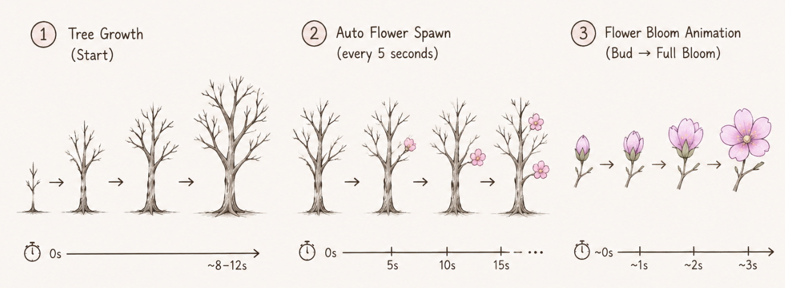

# Interactive Blooming Tree Installation

## Part 1: Project Direction
Our interactive installation explores growth, bloom, and decay through a responsive digital tree. Inspired by the generative tree structure from the [OpenProcessing Tree Project](https://openprocessing.org/@u382178/1942905) and the falling flower visuals from the [Pinterest Falling Flowers Reference](https://uk.pinterest.com/pin/337347828359231168/), we create a dark immersive environment where a tree slowly grows across the screen.

After the tree fully forms, scattered flowers begin to bloom and fall gently, encouraging user interaction. When users hover their mouse over branches, flowers in that area blossom dynamically. Once fully bloomed, mouse clicks trigger the flowers to gradually wither and shed petals.

Sound interaction further animates the installation: fallen petals remain on the ground and react to surrounding audio, bouncing rhythmically with the beat. Through these layered interactions, the project visualizes the fragile cycle between life, beauty, and impermanence.  
### Inspiration 1: OpenProcessing Generative Tree Reference

### Inspiration 2: Falling Flower Motion Reference

## Part 2: Mechanics

### Team Members and Roles

| Team Member | Mechanic |
|---|---|
| Guanghan Li | User Input |
| Jiayi Hou | Time-based |
| Fabiana | Audio |
| Chunyu Zhao | Perlin Noise and Randomness |

### User Input Mechanic

The user input mechanic allows users to directly interact with the tree using their mouse. When the user moves their cursor over the tree branches, flowers will grow at the hover position. This creates the feeling that the user is helping the tree bloom through interaction. Users can also click on any flower to make it break apart into falling petals. These petals will fall naturally to the ground and remain on the canvas instead of disappearing immediately.

This mechanic is designed to make the artwork feel alive and responsive. Instead of watching a passive animation, users can influence the growth and transformation of the tree through simple actions. The interaction also connects with the other mechanics in the project. Over time, more petals collect on the ground, and later the audio mechanic can cause these petals to react and move again. Together, these interactions help create a continuous cycle of growth, decay, and movement within the artwork.

### Time-based Mechanic

The time-based mechanic controls the pacing and progression of the interactive tree experience through timers and event-driven animation. At the beginning of the project, the tree gradually grows onto the screen rather than appearing instantly, creating the feeling of a living digital organism emerging in real time. Once the tree is fully formed, a new flower automatically appears at a random position on the branches every five seconds, encouraging interaction even when the user does not actively engage.

Each flower also develops through timed animation instead of appearing instantly, growing from a small bud into a full bloom. This mechanic helps establish the natural rhythm of the artwork and supports the overall concept of growth, bloom, and decay. By introducing continuous timed changes, the tree feels alive and constantly evolving, even before direct user interaction begins.

### Audio Mechanic

PASTE AUDIO DESCRIPTION HERE.

### Perlin Noise and Randomness Mechanic

I was responsible for implementing Perlin noise and random effects. My work included designing animations for flowers blooming and dynamic effects for falling petals, in which the falling petals rotate while their colors transition naturally through a gradient effect based on Perlin noise. I also utilized random motion algorithms to develop subtle swaying movements for the trees, creating a more lifelike and realistic visual effect. These systems give the installation a dynamic, responsive, and ever-evolving quality, rather than a mechanical repetition.

## Part 3: Putting It Together

All four mechanics work together on the same canvas to create a single interactive tree environment. Time-based events slowly grow flowers over time, while randomness controls the flower positions and colours to make the tree feel organic. User input allows people to grow and remove flowers through hovering and clicking. The audio mechanic then reacts to sound by lifting fallen petals back into motion. Each mechanic affects the others, creating a continuous cycle between growth, interaction, falling petals, and sound-driven movement. The project is visually connected through the tree, the flower colour palette, and the natural motion of petals across the canvas.
