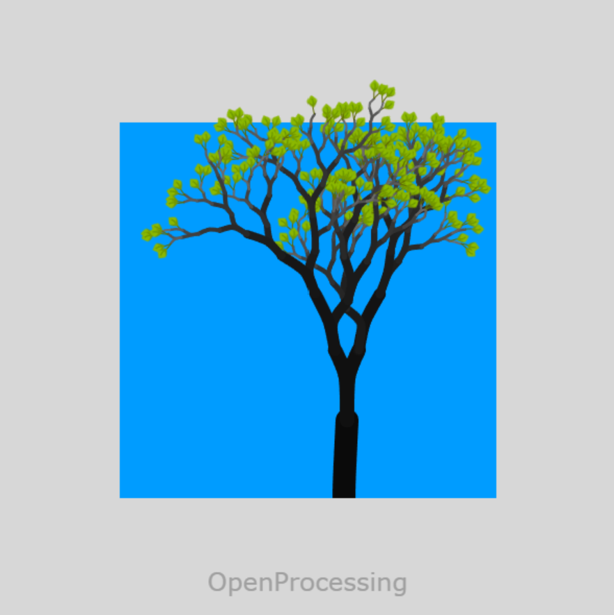
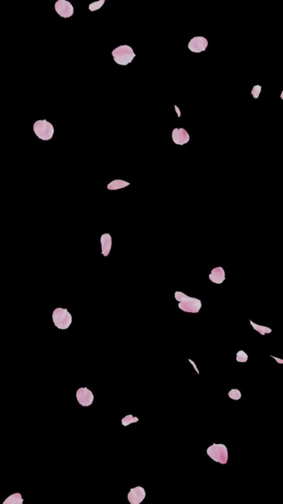
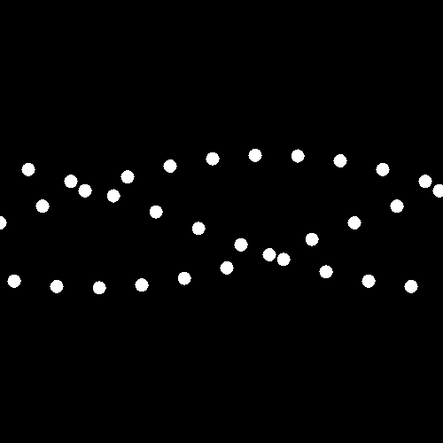
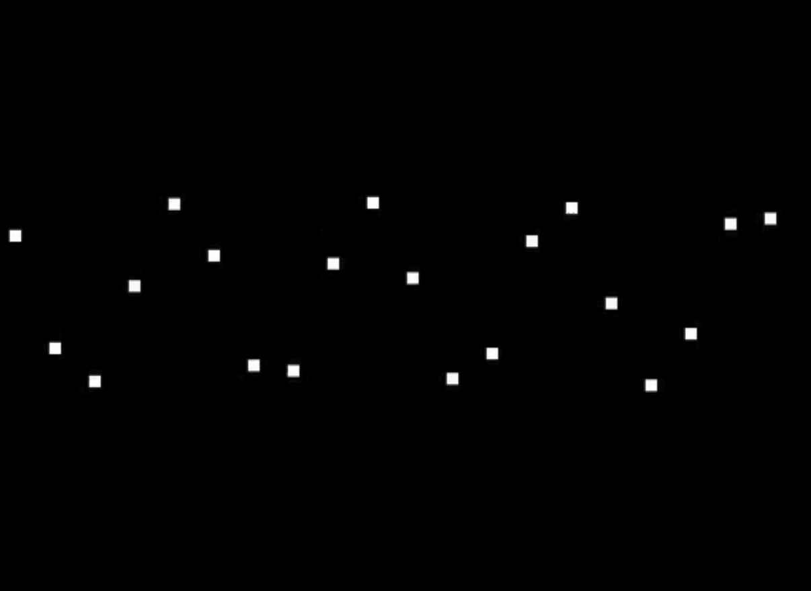

# 🌳 Living Seasons Tree

Original artwork design by Fabiana Fonseca, Jiayi Hou, Chunyu Zhao, and Guanghan Li

---

# 📖 Inspiration
Our project was inspired by the trees that surround us in Sydney, particularly those around Victoria Park near the University of Sydney. As international students, we spend a lot of time walking through these green spaces, and the large, spreading trees have become a familiar part of our daily experience. They represent both the natural environment of Sydney and the sense of growth that comes with adapting to a new place.
The concept did not begin as a tree simulation. During the development process, we explored different ideas and visual directions, but gradually realised that plant growth provided a natural framework for incorporating multiple interactive mechanics. Trees offered opportunities to visualise gradual change, organic movement, user interaction, and audio-responsive behaviours within a single cohesive system.
We were particularly inspired by the way real trees change over time: branches grow unpredictably, flowers bloom, leaves emerge and eventually fall. These natural processes influenced our use of procedural generation, Perlin noise, randomness, timed growth, and interactive blooming. Rather than recreating a specific species, we aimed to capture the feeling of observing a living tree evolving through the seasons.
The final project combines these observations with generative art techniques, creating a digital tree that grows, blooms, sheds leaves, and responds to user interaction and sound. Through this process, we transformed an everyday element of our environment into an interactive experience.

## Visual References
Our visual style combines organic growth, vibrant seasonal colors, and natural motion. The tree serves as the central structure, while flowers and petals introduce contrast, softness, and visual richness. The introduction of audio, both in sound effects and input, bring a sense of play and whimsy reminiscent of childhood.

### Generative Tree Reference

Inspired by the OpenProcessing Tree Project, we've adopted a procedural tree structure that grows organically from the ground upward. The branching system creates a natural and unpredictable silhouette, allowing the tree to feel alive and continuously evolving rather than statically drawn.


### Flower and Petal Motion Reference

Inspired by falling flower animations, we use softly drifting petals that rotate, sway, and descend naturally through space. The movement emphasizes lightness, fragility, and the temporary nature of blooming flowers.


### Petal and Leaf Audio Reactive Movement

We were inspired by the playfulness of bouncing motion. The movement in the piece thus far is very organic and natural, but the audio mic input brings in a level of gamification that lends itself well to the whismy of bouncing motion.
   


---

# ⚙️ Techniques

## Audio

Audio Input is broken into two main subcategories: **environmental sound effects** (controlled by environmentSFX.js) and **microphone-driven interaction** (controlled by audioMechanic.js)

* **Environmental Sound Effects**
    _Keeping in mind that certain browers require user input in order to begin audio playback, the inital tree growth does not automatically have sound effects, users must click "play backgound audio" or the spacebar to trigger playback_
    - Background environmental sound effects of rustling leaves increase the immersion and realism of the piece
    - Users can toggle on and off the rustling audio through a button that changes indicating text based on toggle 
    - A starting chime triggered on a spacebar click provides context for the restart and regeneration of the piece which then automatically leads into looping rustle sfx

* **Microphone Driven Interaction**
    - Microphone captured audio amplitude levels drive vertical "bouncing" movement of both petals and leaves after they have fallen to the ground
    - Both petals and leaves react to the same information recieved, but they translate the information differently. Information begins at the center of the screen for the petals and inversely the edges of the screen for the leaves
    - `p5.AudioIn` is used to capture microphone input 
    - `mic.connect(fft)` takes amplitude information recieved from mic and uses fast fourier transformation to break it down into further values. These values then create rectangles with heights that vary in response to live information. The petals and leaves then use the height of these corresponding rectangles as indicators for y-position movement
    - both petals and leaves use `lerp()` to ease into new y-positions
    - if background sfx toggle button is on or after users have pressed space, sfx will be picked up by mic - indicating to users (if they have not already) the functionality of mic input

---

## Time-based

This mechanic focuses on p5.js timing and animation techniques used to control changes over time, including the day-night cycle, tree growth, sun and moon movement, and passive auto-blooming.

- **`millis()` for elapsed time**  
  `millis()` is used to track how much time has passed since the scene started. This creates the base timing system for the day-night cycle and no-hover auto-blooming.

- **Modulo for a repeating cycle**  
  The elapsed time is repeated using modulo, so the day-night cycle can continue looping instead of stopping after one full cycle.

- **`map()` and `lerpColor()` for background transitions**  
  `map()` converts the cycle progress into smaller stage values, while `lerpColor()` blends between morning, daytime, sunset, dusk, and night colours.

- **`constrain()` for safe progress values**  
  `constrain()` is used to keep movement and growth values within controlled ranges, preventing unexpected jumps.

- **`deltaTime` for tree growth**  
  `deltaTime` controls the tree growth speed based on real elapsed time rather than frame count. This helps the animation remain more consistent across different devices.

- **Sun and moon timing**  
  `isSunVisible()`, `isMoonVisible()`, `getSunProgress()`, and `getMoonProgress()` use the cycle progress to decide when the sun and moon appear and how far they move across the sky.

- **`lerp()` and easing for sky movement**  
  `lerp()` is used in `sketch.js` to calculate the sun and moon positions. An easing function makes the movement smoother and less mechanical.

- **Transparency and layered circles for sky objects**  
  The sun and moon are manually drawn using layered `circle()` shapes and alpha values in `fill()`. This creates soft glow effects and supports the visual atmosphere of the day-night cycle.

- **5-second no-hover auto-blooming**  
  The time mechanic records the latest hover time. If there is no hover interaction for 5 seconds, the tree automatically blooms a flower on a random available branch.

---

## Perlin noise and randomness

Randomness and Perlin Noise are used to create the organic growth, natural variation, and wind-driven movement of the tree system. 

* **Tree Branch Randomness**
  *The tree was designed to grow like a natural organism rather than a perfectly symmetrical structure. To achieve this, branch angles and branch lengths are procedurally varied during the recursive tree generation process.*

  * `getRandomBranchAngles(depth)` controls how each branch splits based on its depth in the tree structure.
  * Larger branches use smaller angle variations so the main tree form grows more steadily and does not become too chaotic.
  * Smaller branches use wider angle variations, allowing the upper canopy to spread out with more detail.
  * `getRandomLeftBranchLength()` and `getRandomRightBranchLength()` give the two child branches different length ratios, preventing the tree from looking mirrored or mechanically repeated.
  * This randomness supports the intended visual effect of a tree shaped by natural growth, where each branch feels related to the whole structure but not perfectly identical.

* **Flower Bloom Randomness**
  *Flowers are intended to appear as part of the tree’s natural blooming process rather than as repeated decorations placed evenly across the canopy.*

  * `getRandomFlowerData()` gives each flower a slightly different size, rotation angle, position offset, and bloom timing.
  * `flowerOffsetX` and `flowerOffsetY` move flowers around branch tips so they cluster naturally instead of appearing in rigid positions.
  * `flowerAngle` rotates each flower so the blossoms do not all face the same direction.
  * `petalTimer` delays flower-related petal behaviour, making the blooming and falling process feel staggered rather than simultaneous.
  * `getRandomFallingFlowerSize()` also gives falling flowers different scales, helping the falling elements feel more varied and natural.

* **Leaf Generation and Falling Randomness**
  *Leaves are used to build the density of the canopy and later support the seasonal transition where some leaves fall while others remain attached.*

  * `getRandomAttachedLeaves()` creates a random number of leaves on each terminal branch using `leafCount = int(random(8, 14))`.
  * Each attached leaf receives a random position offset, rotation angle, and size, which helps the canopy look fuller and less repetitive.
  * `shouldFall: random(1) < 0.45` gives each leaf a probability of falling, meaning only some leaves are selected for the seasonal falling behaviour.
  * This creates a more believable transition because the tree does not lose all leaves at the same time or in the same way.
  * `getRandomLeafData()` controls the movement properties of falling leaves, including falling speed, horizontal speed, rotation speed, and noise offset.

* **Petal Falling Randomness**
  *The petal falling system was designed to create a soft, scattered, wind-blown atmosphere after flowers appear on the tree.*

  * `getRandomPetalData()` assigns each petal a different size, falling speed, horizontal speed, starting angle, rotation speed, colour, transparency, and movement type.
  * `type: int(random(4))` allows petals to use different falling behaviours, so they do not all move in the same pattern.
  * Random colour values create subtle variation within the pink petal palette, making the petals look more organic.
  * `resetPetalRandomData(petal)` allows a reused petal to receive a new set of random properties, so repeated falling cycles still feel visually fresh.
  * This supports the intended effect of petals drifting unpredictably, like they are being carried by changing air currents.

* **Perlin Noise Wind Movement**
  *Perlin Noise is used because the falling petals and leaves need to move like they are affected by wind, not like they are randomly shaking.*

  * `getSoftNoiseDrift(noiseOffset)` maps `noise()` values into a smooth horizontal drift range from `-1` to `1`.
  * `getSmallNoiseDrift(noiseOffset)` creates a smaller drift range from `-0.7` to `0.7`, which is useful for more subtle movement.
  * `updateFastNoiseOffset()` and `updateSlowNoiseOffset()` control how quickly the noise value changes over time.
  * Faster noise updates can create more active drifting movement, while slower updates create gentler background motion.
  * This produces smoother and more believable movement than pure `random()`, because Perlin Noise changes gradually instead of jumping suddenly between values.

* **Random Start Positions**
  *Random starting positions are used to make falling elements enter the scene from different places instead of appearing from one fixed point.*

  * `getRandomCanvasX()` gives falling petals or leaves a random horizontal position across the canvas.
  * `getRandomStartY()` starts falling elements slightly above the visible canvas, making them enter the scene naturally from the top.
  * This helps extend the falling effect across the whole screen and supports the feeling of a larger environment beyond the visible canvas.

---

## User Input

The user input mechanic allows users to interact directly with the tree using their mouse and keyboard.

Applications include:

* Moving the mouse over tree branches triggers nearby flowers to bloom at the closest terminal branch
* Clicking on a fully bloomed flower breaks it apart into falling petals
* Pressing the space bar regenerates a new randomly shaped tree and resets the background cycle

---

* `mouseMoved()` fires every frame the mouse moves, passing the cursor position to the input mechanic for hover detection
* `mouseClicked()` fires on each click, used to check whether the cursor is close enough to a flower to trigger petal release
* `keyPressed()` detects the space bar to call `createNewTree()` and `timeMechanic.reset()`
* `dist()` compares the mouse position against every terminal branch node to find the closest one within a 150px radius
* `millis()` drives two cooldown timers — one limits how frequently hover can trigger a new bloom (200ms), and one prevents immediate re-blooming after a click (2000ms)
* The flower's actual screen position is calculated using `sin()` and `cos()` with the branch angle and growth value, so the click hit area precisely matches what is visible on screen
* Hover interaction calls `timeMechanic.recordUserHover()` to reset the auto-bloom timer, connecting the user input mechanic with the time-based mechanic

---

A bloom cooldown and post-click cooldown work together to prevent accidental
flower spam while keeping the interaction feeling responsive and natural.


# 🎮 Interaction Instructions

## How to Experience the Artwork

1. Open the sketch.
2. Enable brower's microphone input.
3. Observe life cycle of tree throughout the day.
4. Toggle on and off background audio through indicating button.
5. Hover mouse over tree branches to grow additional flowers.
6. Click on flowers to turn them into falling petals.
7. Observe petals drifting naturally in the wind.
8. Use background sfx and/or mic input (user's vocals, music, claps, etc) to "re-animate" fallen leaves and petals.
9. Press SPACE to regenerate new tree and restart experience.

---

# 👥 Mechanic Ownership

| Team Member        | Mechanic                  | Description                                                                                                           |
| -----------        | ------------------------- | --------------------------------------------------------------------------------------------------------------------- |
| Fabiana Fonseca    | Audio                     |  SFX to increase user immersion and mic input used to reanimate fallen petals and leaves.                                                                                                                    |
| Jiayi Hou          | Time-Based Events         |  Time-based system controlling the day-night background cycle, sun and moon movement, deltaTime tree growth, and 5-second no-hover auto-blooming.                                                                                                                   |
| Chunyu Zhao        | Perlin Noise & Randomness |                                                                                                                       |
| Guanghan Li        | User Input                |  Mouse hover to bloom flowers on branches, click flowers to release petals, space bar to regenerate the tree.         |

---

# 🤖 AI Acknowledgement

**Audio** - _Fabiana Fonseca_

Used Copilot within VSC to help smoothly connect rectangle height movement to the corresponding class instances of fallingPetals and fallingLeaves, as well as to refine/debug playback button toggle.

Code works by pushing arrays from fft rectangles that then get referenced by xposition within class instances to gradually match the height of corresponding fft rectangles (using lerp movement). 

**Time-Based** - _Jiayi Hou_

ChatGPT was used to help refine the written explanation of the time-based mechanic and check the accuracy of terms such as `millis()`, `deltaTime`, and `lerpColor()`. The final implementation, including the day-night cycle, sun and moon timing, tree growth, and no-hover auto-blooming, was manually integrated and adjusted within the project.

**Perlin Noise & Randomness** - _Chunyu Zhao_


**User Input** - _Guanghan Li_


---

# 📚 External References

## The Tree 

Source:
https://openprocessing.org

Used as inspiration for generative tree structures and recursive branch generation.

---

## Audio

Source:
https://www.youtube.com/watch?v=uk96O7N1Yo0
https://www.youtube.com/watch?v=2O3nm0Nvbi4
https://edstem.org/au/courses/31325/lessons/98500/slides/672004

Used as inspiration for different audio reactive movement techniques that could then by adapted by the falling petal and leaf instances.

---

## Time-based

Source:  
https://au.pinterest.com/pin/1120129738552090148/  
https://au.pinterest.com/pin/7459155630697561/  
https://au.pinterest.com/pin/416020084353622444/

Used as visual inspiration for the sun and moon elements in the time-based mechanic. The final sun and moon were manually designed in p5.js using layered circles, transparency, and movement based on the day-night cycle.

---
## Perlin noise and randomness

---

## User input

---

# 📂 Project Structure

```text
project-folder
│
├── index.html
├── sketch.js
├── style.css
├── jsconfig.json
├── .gitignore
│
├── tree.js
├── flower.js
├── petal.js
├── inputMechanic.js
├── timeMechanic.js
├── audioMechanic.js
├── environmentSFX.js
├── perlin-randomness.js
│
├── assets/
│   ├── StartingChime.mp3
│   ├── storegraphic-soft-wind-316392.mp3
│   ├── falling-flower-reference.jpg
│   ├── movementInspo1.GIF
│   ├── movementInspo2.gif
│   ├── movementInspo3.GIF
│   ├── StyleInspo.png
│   ├── Time-Based.png
│   └── tree-reference.png
│
├── libraries/
│   └── p5.js related libraries
│
├── README.md
└── READMEOLD.md
```

---

# 🎥 Interaction Instructions

## User Instructions

1. **Wait for the tree to grow** — the tree will slowly grow from the ground up on its own.

2. **Move your mouse over the branches** — flowers will bloom near your cursor as you hover over the tree.

3. **Click on a flower** — the flower will break apart into falling petals.

4. **Press Space** — regenerates a brand new randomly shaped tree and resets the background cycle.

5. **Click "Play Background Audio"** or **press Space** to start the ambient rustling sound effects.

6. **Make some noise** — speak or play music near your microphone and watch the fallen petals and leaves bounce in response to the sound.

7. **Wait and watch** — if you stop interacting, the tree will slowly continue blooming on its own every 5 seconds. The background also gradually shifts through a full day-night cycle.

## Video Documentation

(Add YouTube or Vimeo link here)

---

